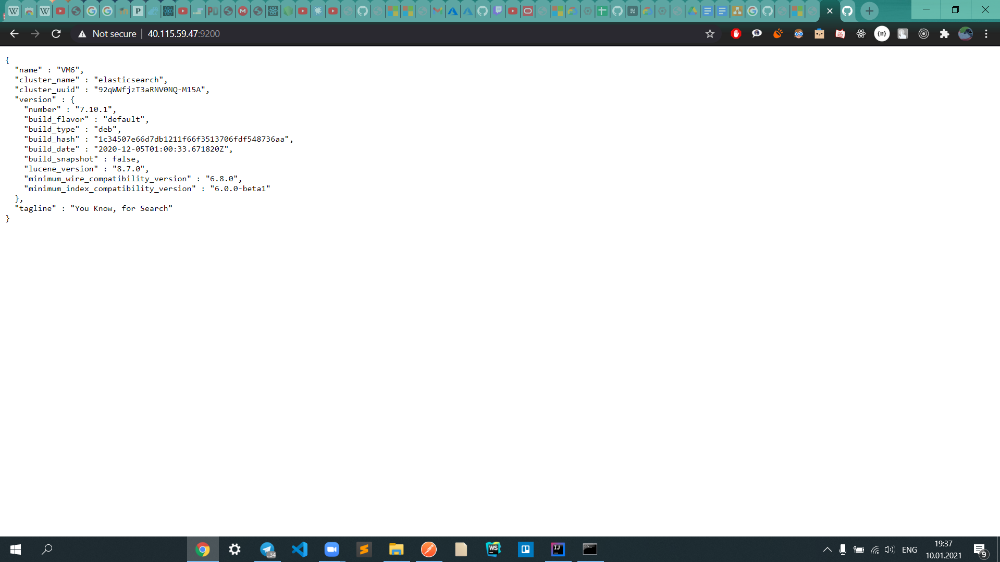
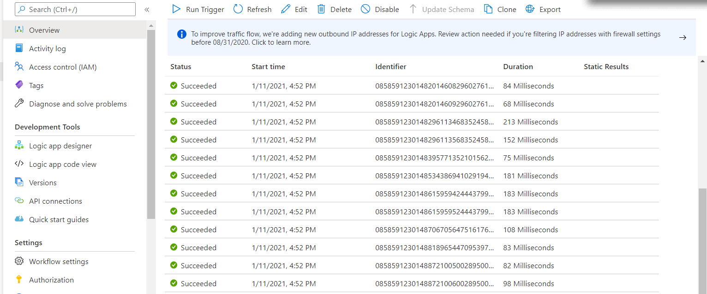
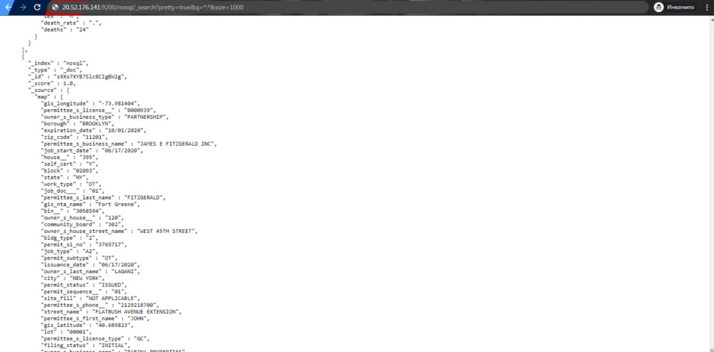

# Azure Configuration

1. Першим кроком треба створити та підняти віртуальну машину Azure. (налаштування залишити дефолтні)
2. Доступаємося до вм за допомогою ssh з'єднання 
3. Для встановлення elasticsearch, kibana та logstach використовуємо цей гайд 
https://logz.io/blog/install-elk-stack-azure/ . Так само там ми знайдемо інструкції по налаштуванню файрволу(відкриття портів, 9200 для еластіку, 5601 для кібани. **Пріорітет має бути нижчий за 80 порт!**
4. Після встановлення elk стеку на нашу віртуалку переходимо по vm-public-ip:9200 та vm-public-ip:5601 для того, щоб перевірити, чи все задеплоїлось правильно

6. Далі переходимо у Logic App > створюємо Blank app > обираємо першим кроком When event hub is listening > конектимося до нашого eventhub
7. Наступним кроком обираємо HTTP POST method та заповнюємо наступним чином 

Відправляємо дані на event hub та перевіряємо, чи спрацювали тригери

Переходимо по адресі еластіку та дивимось чи відобразилися дані

