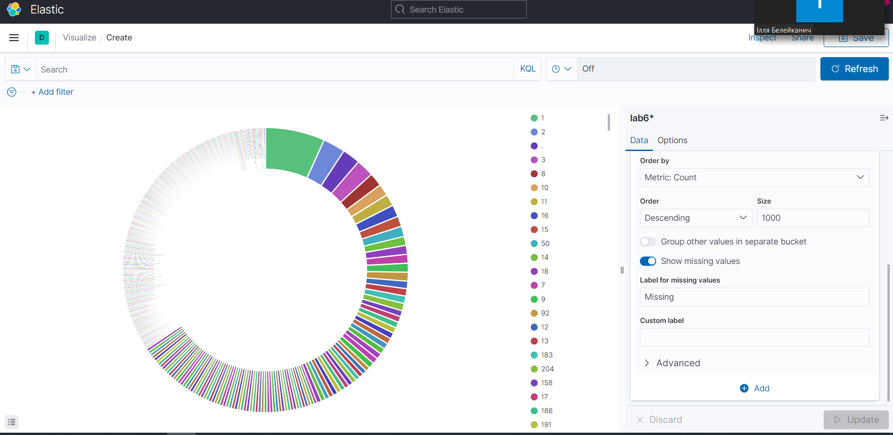
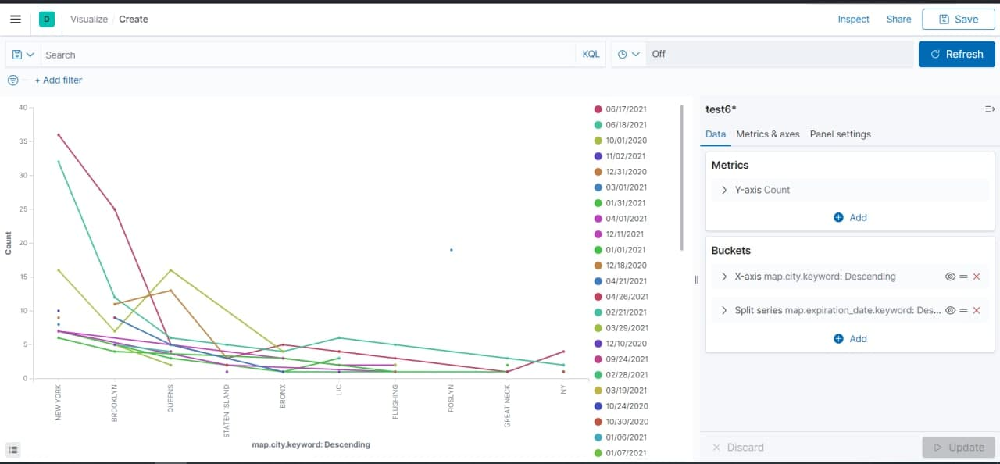
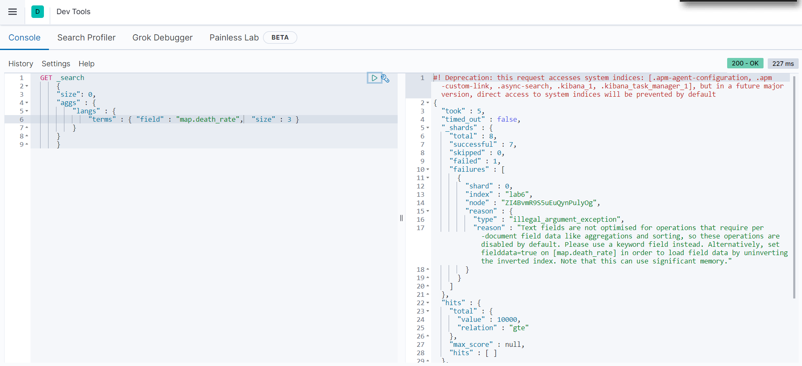
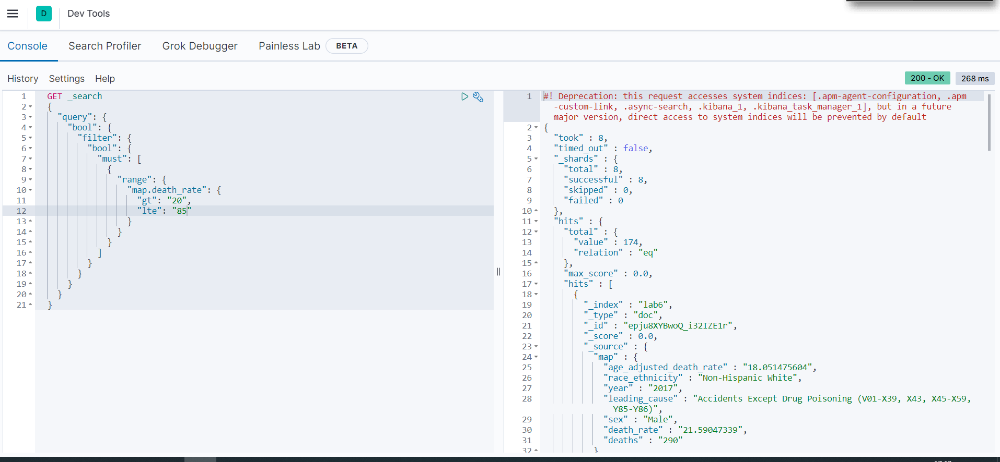

# Kibana Visualize

1. Переходимо у Kibana > Visualize > Pie. (До того треба мати індекс еластіку з 6ої лаби) 



2. При створенні візуалізації треба вибрати налаштування Bucket. 

3. Створюємо нову візуалізацію Line також з налаштованим Bucket за x-axios та Split series




# Dev Tools requests

1. Топ-3 за полем map.death.rate
```
GET _search
{
"size": 0,
"aggs" : {
    "langs" : {
        "terms" : { "field" : "map.death.rate",  "size" : 3 }
    }
}}
```



2. Filter by date
```
GET _search
{
  "query": {
    "bool": {
      "filter": {
        "bool": {
          "must": [
            {
              "range": {
                "map.death.rate": {
                  "gt": "2019-03-21T15:37:08.595919Z",
                  "lte": "2020-04-21T15:52:08.595919Z"
                }
              }
            }
          ]
        }
      }
    }
  }
}
```


